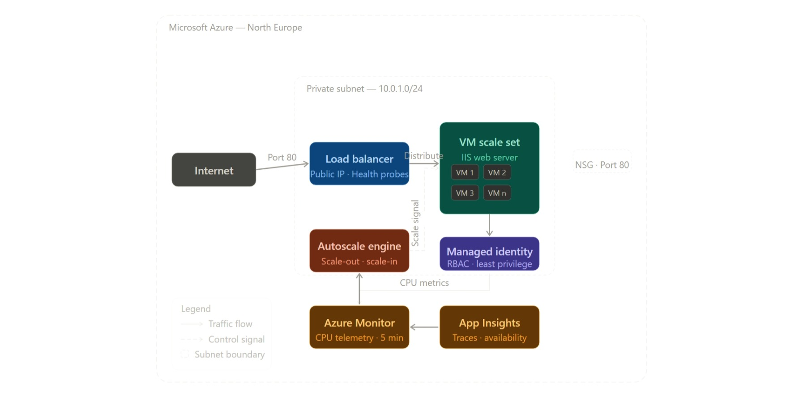
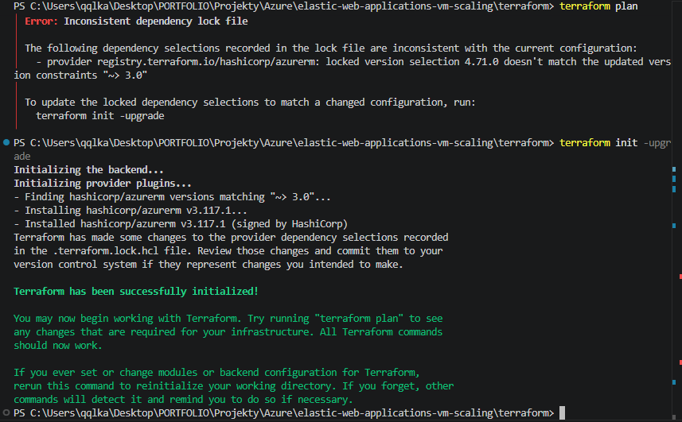
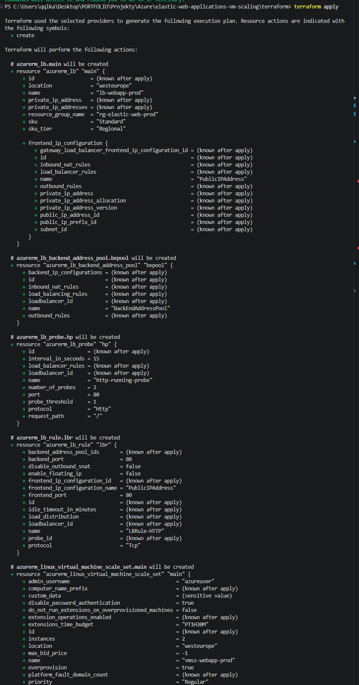
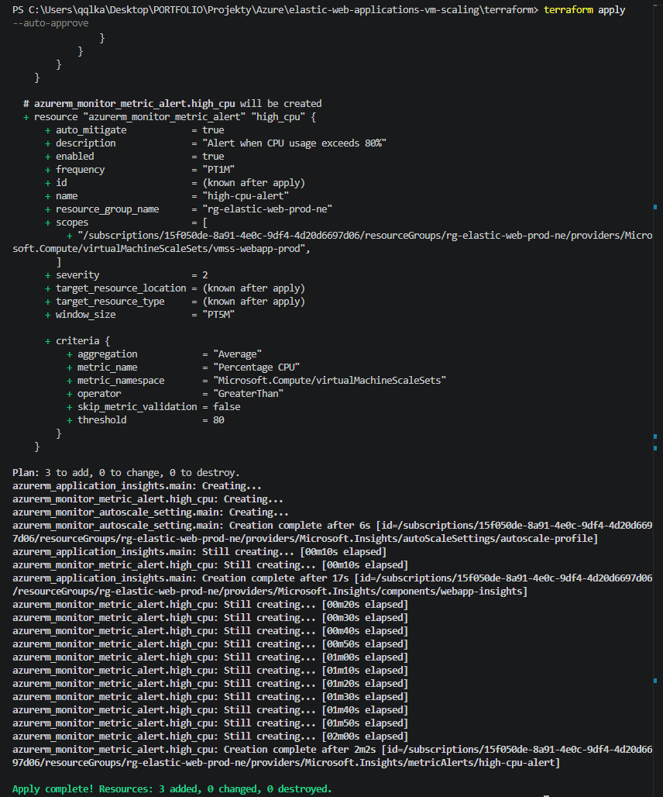
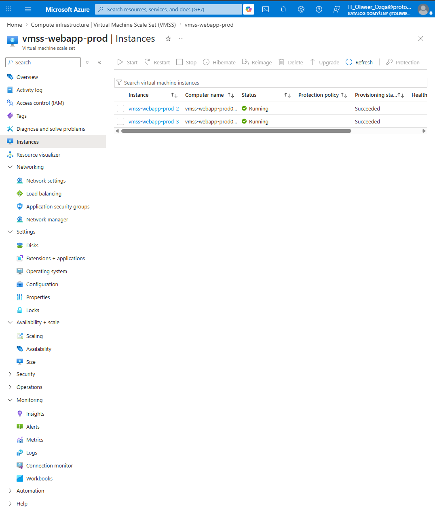
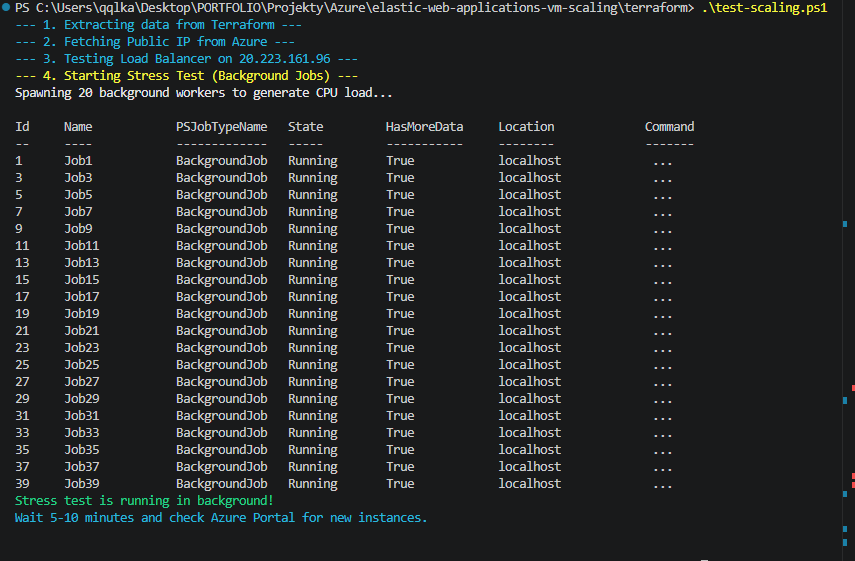
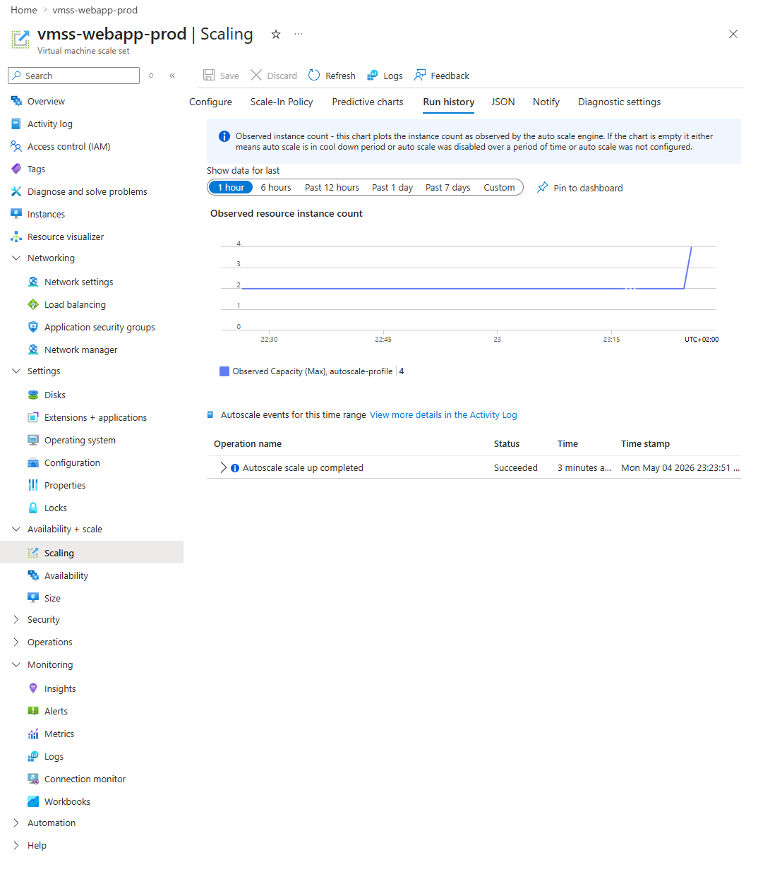
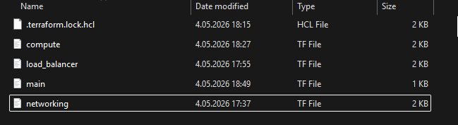

# 🚀 Elastic Web Applications: VM Scaling & Automation Lab

[](https://azure.microsoft.com)
[](https://www.terraform.io)
[](https://www.microsoft.com/iis)
[](https://opensource.org/licenses/MIT)

An advanced Azure-based infrastructure designed to demonstrate **Elasticity** and **High Availability**. This project leverages **Infrastructure as Code (IaC)** to deploy a Virtual Machine Scale Set (VMSS) protected by an Azure Load Balancer, with fully automated scaling driven by real-time CPU performance metrics.

---

## 🎯 Objective

The goal of this project is to build a self-healing and self-scaling web infrastructure. By moving away from static server deployments, this lab implements a **Metric-Driven Scaling Framework** that automatically adjusts compute capacity to match user demand — ensuring cost-optimization and system resilience without manual intervention.

---

## ✨ Key Features

- **Automated Scaling:** Autoscale policies react to CPU telemetry within a 5-minute window, triggering scale-out or scale-in events without human input.
- **Load-Balanced Traffic:** Azure Load Balancer distributes incoming requests evenly across all healthy VMSS instances.
- **Self-Healing Instances:** Health probes continuously verify instance availability; unresponsive nodes are automatically removed from the backend pool.
- **Security-First Design:** Network Security Groups (NSG) and Managed Identities enforce least-privilege access across the entire stack.
- **Reproducible Infrastructure:** Every resource — from VNET to Autoscale rules — is defined in version-controlled Terraform HCL.

---

## 🛠️ Tech Stack

| Layer | Technology |
|---|---|
| Infrastructure as Code | Terraform (HCL) |
| Cloud Provider | Microsoft Azure |
| Web Server | Internet Information Services (IIS) |
| Networking | Azure Load Balancer, VNET, Subnets, NSG |
| Observability | Azure Monitor, Application Insights |
| Governance | Azure Managed Identities (RBAC) |

---

## 🏗️ Architecture

The Load Balancer acts as the public gateway, distributing traffic across a VM Scale Set residing in a private subnet. The Autoscale Engine continuously monitors CPU telemetry via Azure Monitor and dynamically triggers scale-out or scale-in actions to maintain performance SLAs.



---

## 📂 Repository Structure

The project is organized into modular directories to ensure maintainability and a professional workflow:

```
.
├── code/
│   └── terraform/
│       ├── compute.tf          # VMSS definition, OS profiles, and extensions
│       ├── load_balancer.tf    # Load Balancer, backend pools, and health probes
│       ├── main.tf             # Provider settings and resource group definitions
│       ├── monitor.tf          # Autoscale settings and Application Insights
│       ├── networking.tf       # VNET, subnets, and NSG rules
│       └── outputs.tf          # Output values (e.g., public IP address)
├── scripts/
│   └── test-scaling.ps1        # PowerShell script to simulate CPU load for autoscale testing
├── screenshots/                # Architecture diagrams, deployment logs, and scaling evidence
└── README.md
```

---

## 🚀 Deployment

### Prerequisites

- **Azure CLI** — Authenticated via `az login`
- **Terraform** — Version 1.0.0 or higher
- **Service Principal / Managed Identity** — For automated resource management

### Infrastructure Setup

Initialize and deploy the full environment using Terraform:

```bash
# Initialize Terraform and download providers
terraform init

# Preview the execution plan
terraform plan

# Deploy to Azure
terraform apply -auto-approve
```

> [!IMPORTANT]
> After a successful `apply`, Terraform will output the public IP of the Load Balancer. Save it to verify web server availability.

### Teardown

To avoid unnecessary Azure costs, destroy all resources when finished:

```bash
terraform destroy -auto-approve
```

---

## 🔬 Infrastructure Lifecycle

The deployment and management of the environment follow a structured lifecycle, ensuring consistency from initialization to dynamic scaling.

### 1. Initialization & Provider Setup

- **Backend Initialization** — Running `terraform init` to download the Azure provider and create a `.terraform.lock.hcl` file that pins provider versions for reproducible deployments.
- **Module Resolution** — All referenced modules and provider plugins are resolved and cached locally before any plan is generated.



### 2. Execution Planning

- **Plan Generation** — Running `terraform plan` to produce a detailed diff of all resources to be created: VMSS configuration, Load Balancer rules, health probe settings, and NSG rules.
- **Pre-Flight Validation** — Confirming that all resource dependencies, naming conventions, and networking parameters are correct before any changes are applied to Azure.



### 3. Automated Provisioning

- **Full Stack Deployment** — Running `terraform apply` to orchestrate the creation of the Resource Group, VNET, Subnet, NSG, Load Balancer, and VM Scale Set in the North Europe region.
- **Governance Tagging** — All resources tagged with `Environment`, `Project`, and `Tool` labels for cost tracking and compliance.



### 4. Instance & Connectivity Monitoring

- **Baseline Verification** — Confirming the initial VMSS instance count and health state in the Azure Portal before any load is applied.
- **Health Probe Validation** — Verifying that the Load Balancer health probes are returning healthy responses from all backend instances on Port 80.



### 5. Stress Testing

- **Synthetic Load Generation** — Executing `test-scaling.ps1` via PowerShell to push CPU utilization past the configured autoscale threshold (0.5%) across active VMSS instances.
- **Threshold Triggering** — Sustained load causes Azure Monitor to register a metric breach and queue a scale-out action.



### 6. Autoscale Validation

- **Run History Review** — Monitoring the Autoscale run history in the Azure Portal to confirm that scale-out and scale-in events fired at the expected CPU thresholds and within the configured cooldown window.
- **Instance Count Change** — Verifying the VMSS instance count increased during load and returned to baseline after the cooldown period elapsed.



### 7. Post-Deployment Cleanup

- **State Hygiene** — Removing local Terraform state files, provider caches, and temporary outputs to ensure a clean, residue-free environment for the next deployment cycle.
- **Cost Control** — Running `terraform destroy` to fully deprovision all Azure resources and eliminate ongoing charges.



---

## 🧩 Challenges & Solutions

| Challenge | Description | Resolution |
|:---|:---|:---|
| **Identity Propagation** | VMSS instances couldn't forward logs to Application Insights. | Assigned a `SystemAssigned` Managed Identity with the `Monitoring Metrics Publisher` RBAC role. |
| **Health Probe Failures** | Load Balancer marked instances as unhealthy. | Updated NSG inbound rules to allow Port 80 traffic from the `AzureLoadBalancer` service tag. |
| **Server Instability** | Ongoing instance instability required approximately 10 instance swaps during testing. | Implemented a strict cleanup routine between deployments to ensure a consistent, residue-free environment. |
| **Load Testing Struggles** | VM instances resisted synthetic high CPU loads, making autoscale triggers difficult to hit. | Lowered the scale-out CPU threshold to **0.5%** to successfully validate Load Balancer behavior and Autoscale triggers. |
| **Scaling Lag** | Scale-out response was too slow during sudden traffic spikes. | Reduced the metric aggregation window to 5 minutes and tuned the `cool_down` period. |

---

## 🏁 Conclusion

This project successfully demonstrated a production-ready **Elastic Web Architecture**. By combining Terraform for reproducible infrastructure and Azure Monitor for intelligent scaling, the system not only survives high-traffic events but also scales down during idle periods to minimize cost — embodying the core principles of cloud elasticity.

### 💡 Key Takeaways

- **Infrastructure as Code** — Terraform makes scaling logic versionable, auditable, and shareable across teams.
- **Self-Healing by Design** — Health probes ensure traffic is only ever routed to fully functional web server instances.
- **Observability & Security** — Managed Identities paired with Application Insights provide deep visibility without exposing credentials.

---

## 👤 Author

**Oliwier Ozga** — [LinkedIn](https://www.linkedin.com/in/oliwier-ozga-380192405/)

---

## 🤝 Credits & Acknowledgments

- Inspired by the cloud architecture patterns and labs from **mzazon** — [mzazon/cloud-projects](https://github.com/mzazon/cloud-projects).
- Special thanks to the Azure Documentation team for best practices on VMSS and Load Balancing.
- Guided by real-world **SRE (Site Reliability Engineering)** principles of automation, scalability, and cost-awareness.
